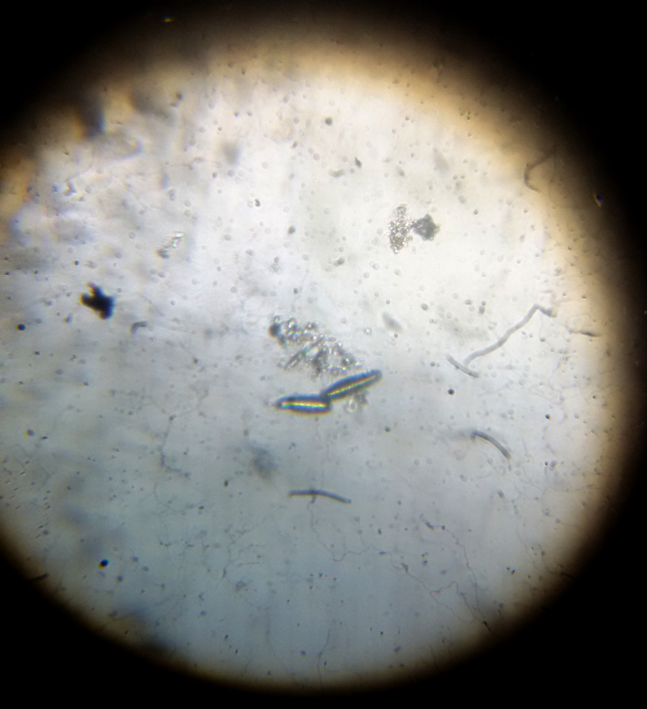

# Materials and methods {#mat-met}

## Germplasm

The genotypes used in the current study consisted of 104 diverse lines of wheat that have been advanced as representative lines bearing variable resistance to diseases. Four check varieties (Described in Table \@ref(tab:check-vars-info)), released at different periods, adapted to a range of environmental conditions in Nepal were included alongside in the study. The genotypes were tested for their phenotypic traits that have potential implications for prolonging the leaf health during post anthesis period. Table \@ref(tab:yld-morph-md) enlists trait observations that were taken during the study in chronological order.

```{r check-vars-info, results='asis'}
checks_data <- suppressMessages(read_csv("./data/check-varieties-wheatatlas-info.csv", 
                          na = c("Unknown", "No Info", "")))
knitr::kable(x = suppressWarnings(colnames(checks_data) %>% rbind(checks_data) %>% 
               column_to_rownames(var = "Name") %>% 
               t() %>% 
               as.tibble() %>% 
               rename("Characteristics" = "Name")), 
             format = "latex", align = "c", 
             booktabs = TRUE, 
             escape = F,
             longtable = TRUE,
             caption = "A summary of check varieties used in the study") %>% 
  kableExtra::kable_styling(full_width = FALSE, font_size = 8) %>% 
  kableExtra::column_spec(1, width = "2.0cm") %>% 
  kableExtra::column_spec(2:5, width = "3.2cm")
```


The trial was conducted under the condition of natural exposure to environmental factors (biotic and abiotic). The field is located at agronomy Farm of Agriculture and Forestry University(AFU), Chitwan, Nepal. A brief geographical context of the experimental site, and a glimpse at history of prevailing weather over the growing season, based on previous year data, are shown in Table \@ref(tab:site-fact-tab) ^[http://wheatatlas.org/station/NPL/22506/] and Figure \@ref(fig:weather-previous).

\small{
\begin{longtable}[]{@{}ll@{}}
\caption{\label{tab:site-fact-tab}Site of study factsheet}\\
\toprule
\textbf{Particulars} & \textbf{Detail}\tabularnewline
\midrule
\endhead
Institution & Agriculture and Forestry University\tabularnewline
Farm & Rampur\tabularnewline
State & Chitwan\tabularnewline
Longitude & \(84.4^o\)\tabularnewline
Latitude & \(27.62^o\)\tabularnewline
Altitude & 191 meters\tabularnewline
Environment & ME1\tabularnewline
Dominant Soil(FAO classification) & Cambisols (Dystric
Cambisols)\tabularnewline
Surface pH & 5\tabularnewline
Cropping system & Rice-wheat\tabularnewline
\bottomrule
\end{longtable}
}

```{r weather-previous, fig.cap="Mean air temperature 2m above surface at the site of study a year before expected wheat growing season", out.width="90%", fig.align='center'}

```

\setlength{\baselineskip}{1.5\baselineskip}

## Planting and management

Field was sown in Nov 24, 2016. Seeds were continuously sown within a row while maintaining a between row distance of 25 cm. Seeding depth of 3-5 cm was maintained. Soil sampling (results not shown) show that the dominant soil texture type occuring in the study site is medium to heavy loamy soil. Weeding was carried out twice, first 40 days after sowing and second 70  days after sowing. Blanket recommendation of fertilizer application was followed; Initially, full dose of $K_2O$ (60 $kg\ ha^{-1}$) and $P_2O_5$ (60 $kg\ ha^{-1}$) were applied at the time of sowing, with Nitrogen (fed as Urea) in split doses(60 kg N $ha^{-1}$ as basal and remaining 60 kg N $ha^{-1}$ top dressed after irrigation). Total lengths of the field row and column were 18 $m$ and 19.5 $m$, respectively. Individual plots of size 0.94 $m^2$, occupying a Total area of 351 $m^2$ (Net Plot Area: 225 $m^2$) were laid in rectangular grids of regular shapes.

Irrigation was limited to once-only throughout the growing period. It is expected that the field will have ample amount of residual moisture during crops' establishment period to start with, because the site usually stays logged with water during the months of August and extended halves of September. The irrigation will be scheduled to best avoid pre-antheis moisture stress, as this has been implied in largest losses resulting in number of fertile florets and the final grain weight [@innes1981effect]. Water will be sourced from a deep tubewell and the field will be moistened untill saturated field condition will have been achieved.

Application of insecticidal sprays and disease checking sprays were avoided. This is to promote natural epiphytotic conditions. Observations on disease severity were mostly taken in reference to Zadok's scale of growth scoring.

## Design, treatments specification and layout 

Current study, using a small number of check varieties and sparing amounts of test entries, is adapted to fit a problem domain of early genration varietal testing applying row-column design for smaller number of checks. This allows for the estimation of design effects as spatial components, as well as for specification of custom spatial error model, if required.

- Number of rows ($k$): 12

- Number of columns ($s$): 20

- Number of checks ($\nu_{\textit{c}}$): 4

- Number of rowgroups ($g_k$): 3

- Number of colgroups ($g_s$): 4

- Number of new entries ($\nu_{\textit{e}}$): 104

- Number of plots allocated to checks per block ($\nu_{g_{k}g_{s}}$): _variable_

An augmented design that accomodates $\nu_{\textit{e}}=104$ unreplicated entries and $\nu_{\textit{c}}=4$ replicated check cultivars with the number of rows $\textit{k} = 12$ and the number of columns $\textit{s} = 20$ was been generated. Each row and column is a complete block with respect to checks. A block ($g_{k}g_{s}$) specified by intersection of a rowgroup and a colgroup contains complete but varying number of check plots. A field layout of the the randomized design has been shown in Figure \@ref(fig:augmented-layout).

```{r augmented-layout, fig.align='center', fig.cap="Randomized layout of Augmented Row-Column Design", out.width="90%"}
knitr::include_graphics("./images/design_layout.png")
```


## Sampling and statistical analysis

Individual plots were sampled for making observations. At least four plant hills, except for visual scoring and making observations on plant-environment interacting response (eg. canopy temperature depression, soil temperature and soil moisture traits) where distinct protocol exists, were randomly selected and a few representative tiller from each hill were duely analysed for their relevent traits (enlisted in Table \@ref(tab:yld-morph-md)).

As described earlier in Section \@ref(stat-an-aug-row-col), a mixed linear model of the form as shown (with modification), in Equation \@ref(eq:fixed-linear-model-form) was fitted for each of the response variables
$y$. The $genotype$ term was further partitioned to separate out Check cultivars and entries [@piepho2006note]. An assumption regarding entry genotypes that these arise from a common set of germplasm and that as a whole represent all variation in a breeding population of interest was made.

All model terms except for the Check variety effects, which was considered as fixed because they are purposely selected, were expressed with random intercept terms for obtaining model parameters (Wolfinger et al., 1997). Model fitting was done through `lmer` function of **lme4** package. The model formula was fitted for obtaining REML estimates of the parameters by a single call to for both fixed and random effects terms. A general matrix structure representation in a linear mixed model with conditional distribution of $y$ given $\mathcal{B} =\beta$ can be represented as shown in Equation \@ref(eq:linear-mixed-form),

<!-- $$(y|\mathcal{B}) \approx \mathcal{N}(X\beta + Zb, \sigma^{2}W^{-1})$$ -->

\begin{equation}
(y|\mathcal{B}) \approx \mathcal{N}(X\beta + Zb, \sigma^{2}W^{-1})
(\#eq:linear-mixed-form)
\end{equation}

where $Z$ is the $n \times q$ model matrix for the $q$-dimensional vector-valued random effects variable, $\mathcal{B}$, whose value we are fixing at $b$. The unconditional distribution of $\mathcal{B}$ is also multivariate normal with mean zero and a parameterized $q \times q$ variance-covariance matrix [@bates2014fitting].

For multiple comparison of fixed effects means and stepwise variable selection procedure, least squares means and confidence intervals were calculated by Satterthwaite approximation of degrees of freedom [@alexandra2017]. 

Likewise, Relative Efficiency (RE) of alternative model over null model was calculated to augment the decision about model selection. Formula \@ref(eq:relative-eff) was used to compute RE.

\begin{equation}
RE = \frac{Error\ variance\ of\ Null\ Model}{Error\ variance\ of\ Alternative\ model}
(\#eq:relative-eff)
\end{equation}

All exploratory and analytical works were accomplished in "R" (an open source computing environment), with open source statistical packages. An extensive list of all packages used in the course of modeling and inference is provided in Appendix \@ref(ii).

## Leaf health assessment {#leaf-health}

Leaf health trait was explained as a composite of two componenet traits- leaf greenness trait and foliar pathogen associated leaf disease score- each of which, on their own, are more readily observable phenotypic traits. 

### Flag leaf greenness assessment {#greenness}

A two approach method has been adopted to describe the SG feature. This feature was defined as:

  1. Leaf Area Under Greenness(LAUG) approach
    
    - difference for 0-9 visual score of green coloration (chlorophyll) of flag leaf at anthesis (Zadoks stage 65), medium milk (Zadoks stage 75) and soft dough (Zadoks stage 85) stages.

  2. SPAD approach
    
    - difference in SPAD values(recorded at Zadoks stage 65 and 85) of flag leaf.

The leaf greeenness scores was considered to group genotypes into classess shown in Table \@ref(tab:leaf-greenness):

```{r leaf-greenness, results='asis'}
knitr::kable(x = read.csv("./data/disease_score_convention.csv", 
                          header = TRUE, comment.char = "#") %>% 
               select(2,1) %>% slice(1:4) %>% 
               mutate(score_rating = stringr::str_replace_all(score_rating, "\"", "")), 
             col.names = c("Greenness score", "Greenness rating"), 
             format = "latex", booktabs = TRUE,
             caption = "Leaf greenness score intrepretation") %>% 
  kableExtra::kable_styling(full_width = FALSE, position = "center", latex_options = c("HOLD_position")) %>% 
  kableExtra::row_spec(0, bold = TRUE)
```

A similar method has been outlined by [@joshi2002relationship] for SG trait assessment in wheat. But, current method employs emperical basis outlined in [@joshi2007stay] for LAUG calculation. The Leaf Area Under Greenness (LAUG) based on greenness scores over time [@plank1963plant] was estimated from the Equation \@ref(eq:laug-van-plank)

\begin{equation}
LAUG = \sum_{i = 1}^a \left [\left\{ \frac{Y_i + Y_{(i+1)}}{2}\right\} \times (t_{i+1}-t_i)\right ]
(\#eq:laug-van-plank)
\end{equation}

### Foliar blight complex associated leaf disease scoring

Disease score observations of individual plots were made for foliar disease pathogens (*Cochliobolus sativus*, *Pyrenophora tritici-repentis*) with attributable symptoms [@duveiller2012wheat] in a way descibed by [@saari1975scale]. Presence of the pathogen complex was revealed upon microscopic studies, during early stage diagnostics of the disease. A image of *Cochliobolus sativus* seen under the microscopic in a slide slide is shown in Figure \@ref(fig:microscope-disease) as confirmatory diagnosis of foliar blight pathogen as causative agent of Foliar blight disease.. A single digit scoring system was adopted for scoring 5 random plants on each plot the flag leaf and the other directly lower to it. The score categories explaining the response to disease is interpreted in Table \@ref(tab:fpa-leaf-score).


```{r microscope-disease, fig.cap="An image of slide under microscope showing \\textit{Cochliobolus} spp.", fig.align='center', fig.width=4, fig.asp=0.7, out.width="80%"}

```


```{r fpa-leaf-score, results='asis'}
knitr::kable(x = read.csv("./data/disease_score_convention.csv", skip = 8) %>% 
               mutate(fpa_leaf_score = stringr::str_replace_all(fpa_leaf_score, "\"", "")), 
             format = "latex", 
             booktabs = TRUE,
             caption = "Foliar pathogen associated disease score interpretation", 
             col.names = c("Disease score", "Score rating")) %>% 
  kableExtra::kable_styling(full_width = FALSE) %>% 
  kableExtra::row_spec(0, bold = TRUE)
```


For assessing foliar pathogen associated leaf score, scoring was limited only upto Zadok's stage S77(Late milk stage). This is to acknowledge the fact that, after this stage the natural cycle of senescence confounds the effects that follow due to pathogen activity [@neupane2007major].

## Observation {#obs}

Data were recorded from the field for the following response variables.

### Yield, morphology, phenology, soil and atmospheric conditions

The record of all observations made on field, those including crops' yield, morphology, phenology traits, and fields' soil and atmospheric conditions has been shown in Table \@ref(tab:yld-morph-md).

```{r yld-morph-md, results='asis'}
yld_var_table <- readxl::read_xlsx("./data/observation_data_record.xlsx", sheet = "yld_morph", skip = 1)
knitr::kable(yld_var_table %>% slice(-stringr::str_which(.$Data, "#")), 
             format = "latex", longtable = TRUE,
             align = "l", booktabs = TRUE, 
             caption = "Field records of crop yield, morphology, phenology, and soil and atmospheric conditions") %>% 
  kableExtra::kable_styling(full_width = FALSE) %>% 
  kableExtra::column_spec(1, width = "5.2cm") %>% 
  kableExtra::column_spec(2, width = "8.2cm")
```


## Missing values treatment

Missing values are largely a result of omitting improbable and extreme values due to biases in observation. In particular, two plots have been systematically left out from the observation record and further analysis because of less than optimal plant population stand. Nevertheless, mixed modeling procedure employed in inference offers fairly robust measures against such occurances [@west2014linear]. For other procedures like  correlation analysis (Shown in Table \@ref(tab:plot-starred-corr)) pairwise complete data were used in computing the correlation coefficients. Similarly, in multivariate procedures such as PCA and cluster analysis, only complete cases were used in obtaining distance matrix.

<!-- ### Daily weather over crop period^[https://power.larc.nasa.gov/] -->

<!-- Weather data was acquired for the site of study is shown on Table \@ref(tab:daily-weather). -->

<!-- ```{r daily-weather, results='asis'} -->
<!-- knitr::kable(x = readxl::read_xlsx("../data/observation_data_record.xlsx", sheet = "daily_weath", skip = 1),  -->
<!--              format = "latex", align = "c",  -->
<!--              booktabs = TRUE, escape = F,  -->
<!--              caption = "Daily weather data of field site over the duration of study") %>%  -->
<!--   kableExtra::kable_styling(latex_options = c("HOLD_position"),  -->
<!--                             full_width = FALSE) %>%  -->
<!--   kableExtra::column_spec(0, width = "12cm") -->
<!-- ``` -->
