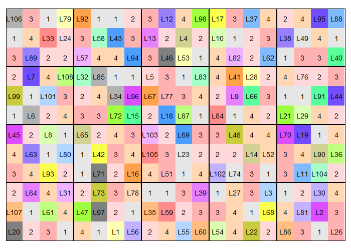
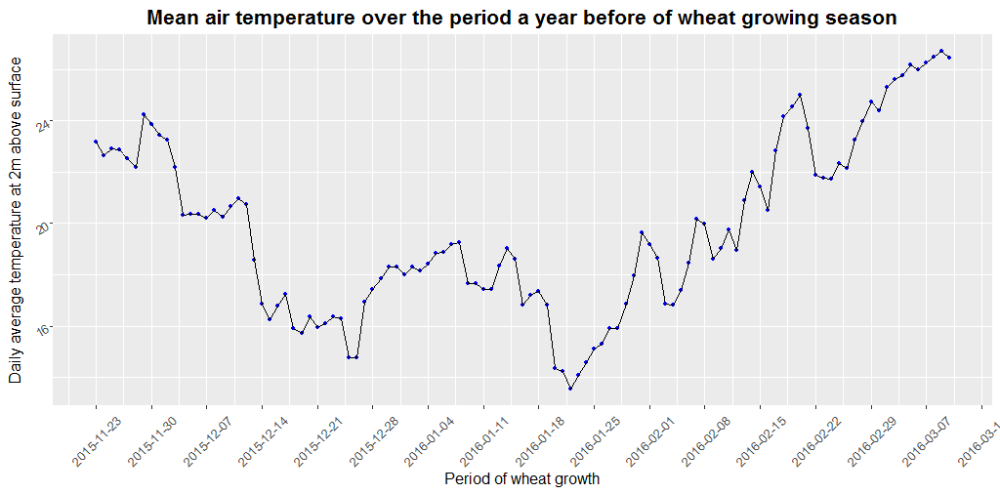

```{r setup, include=FALSE}
knitr::opts_chunk$set(echo = FALSE)
```

## Introduction {.build}

### Leaf health

- At phenotypic level, genotypes may be typed as being healthy or not assessing their expression of signs or/and symptoms in response to stressing conditions.

- Plant's performance given stress has often been ascribed to green and viable leaves contributing to photosynthesis during grain maturation in wheat[@thorne1982distribution]. 

- Post-anthesis foliar health could act as a proxy for determining final grain yield. It is implied in  the grain filling behavior of a plant. Ideally, the contribution of pre-anthesis photosynthetic reserves to the final grain yield has been found to stall around 5% to 10%[@sharma1992duration]. 

----

- Terminal leaves, particularly the flag leaf and the one directly below it, have significant contribution to genotypic variation in yield [@aslam1978photosynthesis] with respect to provisioning of assimilate to functionally active parts of plants including the grain.

- The yield synthesis post-anthesis is mainly a function of leaf area duration, which in turn can be expressed in terms of leaf area index at anthesis and leaf longevity [@bingham1969physiological].

- Since there exists a strong positive relationship between duration of photosynthetically active leaf area and grain yield [@rawson1983changes], breeding programs may benefit for improving yields by targeting indicators of plant's healthy leaf area, as well as the time dependent changes prolonging photosynthetic capacity of a leaf [@lupton1972further]. The latter is often explained as the stay green(SG) trait-- indicative of leaf longevity and expressed as decline in photosynthetically active chlorophyllous surface--of a genotype [@joshi2007stay].

----

- In wheat, genotypic differences in SG have been reported to possess high heritability, with variation being controlled by relatively smaller number of alleles [@silva2001genetic].

- The maintenance of green coloration by plants enables them to maintain lower canopy temperatures [@kumari2013association] which may be less favorable for pathogens requiring relatively higher temperatures for faster growth and development.

- The SG trait is also implicated in genotypic character conferring disease resistance, particularly those exhibiting foliar symptoms [@joshi2007stay].

- Study of leaf features as SG trait, foliar-disease resistance(assessed as levels of necrotic or chlorotic patches symptomatic of a pathogen), leaf area index(LAI), leaf waxyness and glaucousness might provide insights into yield determination processes that operate under field conditions.

----

### Spatial designs in a field trial

- Presence of error variance characterizes biological systems.

- For a plant breeding program, early testing problem is to have to reliably discriminate among a large number of genetic resources.

- An augmented design in where a randomized design trial having a certain fraction of the plots allocated to check cultivar is augmented with entries in some optimized design framework with partial or no replication at all [@piepho_augmented_2016; @federer_augmented_1994].

- The **Augmented Row-Column Design**, a much later addition, are more flexible; they allow for arbitrarily large number of new cultivars to be tested, in a range of different numbers of rows and columns, and even allow for dealing with additional form of three way field heterogenity.

## Statement of problem

- Due to intrinsic nature of agricultural land and unattended sources of heterogenity, breeding materials under test are limited in precision to their effects estimation. Spatial experimental design framework suited for early generation varietal trial, which accomodates large number of treatment entries in the study, could provide an efficient alternative to traditional block designs. 

- Similarly, the new framework provides capability to discriminate variation among genotypes of different genetic backgrounds. The recovered intra-block information, will be used to study traits that contribute to post-anthesis photosynthetic efficiency and finally to the grain yield.

- A better preparedness and potential addition of useful germplasm to the arsenal of tools available for tackling food security challanges and scenario of global climate change.

## Objectives {.build}

### Broad

- To make use of grid based designs in spatial pattern analysis of factors associated with post-anthesis leaf health

### Specific

- To identify plant traits enhancing post-antheis leaf longevity
- To identify potential genotypes with favorable variation for enhanced post-antheis leaf health
- To study reliability of yield prediction using post-antheis terminal leaves associated traits.

## Hypothesis

- Field spatial patterns have significant effects in vegetative and reproductive traits.
- Spatial patterns are often confounded with non estimable environmental effects.
- Genotypes with certain leaf characterstics give better yields than others.
- Genotypic variation in yield and yield component traits can be explained by post-antheis leaf health.

## Methods and methodology

- SG trait was measured by as: 
  - Difference for 0-9 visual score of green coloration (chlorophyll) of flag leaf at anthesis(Zadoks stage 65), medium milk(Zadoks stage 75) and soft dough(Zadoks stage 85) stages. 
  - Difference in decline of SPAD(recorded at Zadoks stage 65 and 85).
  
- A similar method has been outlined by [@joshi2007stay] for SG assessment in wheat.

----

### Statistical analysis

- Using linear models with effects for the row and column factors, genotypes, rowgroup, columngroup, and rowgroup-columngroup interaction [@piepho_augmented_2016].

- A full model for a response y is of form:

$$
y=\mu+rowgroup+colgroup+rowgroup.colgroup+rowgroup.row+colgroup.col\\ +genotype+\epsilon
$$

where, $\mu$ is the common intercept and $\epsilon$ is the residual plot error.

- An augmented row-column design may be analysed considering spatial model for plot error($\epsilon$)[@clarke2011optimal]. A linear mixed effects model with spatial covariance structure specified for plot error($\epsilon$) may be fitted.

----

### Trial setup

- Conducted under the condition of natural influence of biotic factors (Application of insecticidal sprays and disease checking sprays avoided.)

- Zadok's stage with score of only upto S77(Late milk stage)will be investigated for changes in leaf senescence pattern. This is to acknowledge the fact that, after this stage the natural cycle of senescence confounds the effects that follow due to pathogen activity [@neupane2007major].

- Irrigation will be limited to once only throughout the growing period.

----

- The irrigation will be scheduled to best avoid pre-antheis moisture stress, as this has been implied in largest losses resulting in number of fertile florets and the final grain weight(Innes and Blackwell 1981).

- The dominant soil type of the study site is a medium to heavy textured loam.

### Dimensions of the field
- Total length of column: 19.5m 
- Total length of row: 18m 
- Individual plot size: 0.94 $m^2$
- Total Area: 351 $m^2$
- Net Plot Area: 225 $m^2$
  
----
  
### Design, treatments specification and layout
- Number of rows($k$): 12
- Number of columns($s$): 20
- Number of checks($\nu_c$): 4
- Number of rowgroups($g_k$): 3
- Number of colgroups($g_s$): 4
- Number of new entries($\nu_e$): 104
- Number of plots allocated to checks per block($\nu_{g_{k}g_{s}}$): _varies_

----

### Randomized layout of the experimental design

```{r des-layout, out.height="550px", out.width="700px", fig.align='center'}

```

----

### Site of study factsheet^[http://wheatatlas.org/station/NPL/22506/]

| Particulars | Detail |
|:--:|:----:|
| **Institution** | Agriculture and Forestry University |
| **Farm** | Rampur |
| **State** | Chitwan |
| **Longitude** | $84.4^o$ |
| **Latitude** | $27.62^o$ |
| **Altitude** | 191 meters |
| **Environment** | ME1 |

----

### Site of study factsheet...Contd.

| Particulars | Detail |
|:--:|:----:|
| **Dominant Soil(FAO classification)** | Cambisols (Dystric Cambisols) |
| **Surface pH** | 5 |
| **Cropping system** | Rice-wheat |

----




----

### Basic information on the check cultivars

|    |Aditya^[http://wheatatlas.org/varieties/detail/22373]|Bhrikuti^[http://wheatatlas.org/varieties/detail/22378]|Gautam^[http://wheatatlas.org/varieties/detail/22383]|Tilottama^[http://wheatatlas.org/varieties/detail/26413]|
|:--:|:----:|:------:|:----:|:-------:|
|Year released|2010|1994\*|2002|2014|
|Synonym|HD-2781\*|NL-623\*|BL-1887; NC-1838-4B-020B-020B-2B-0B\*|NL 1073; NL1073; NL-1073; FRANCOLIN; FRANKOLIN|
|Wheat type|Bread|Bread|Bread|Bread|
|Semidwarf (Rht gene)|No Info|Yes|Yes|Yes|
|Grain color|White grain|Unknown|Unknown|Unknown|
|Grain hardiness|Unknown|Unknown|Unknown|Unknown|

----

### Basic information on the check cultivars ...Contd.

|    |Aditya|Bhrikuti|Gautam|Tilottama|
|:--:|:----:|:------:|:----:|:-------:|
|Pedigree|GS348/NL746//NL748; BOBWHITE/C-306/C-591/HW-2004\*|CONTESTADO/COCORAQUE F 75/3/POLLO//FURY/ANAHUAC F 75; CLEMENT/COCORAQUE-75/3/POLLO//FURY/ANAHUAC-75\*|SIDDHARTHA/NG 8319//NL 297 or SIDHHARTHA/NG 8319//NL 297|WAXWING*2/VIVITSI|
|Selection history|HD-2781\*|NL 623 FR 2308-2F-1F-0F; NL-623\*|NC 1838-4B-020B-020B-2B-0B|CGSS-01-B-00056T-099Y-099M-099M-099Y-099M-14Y-0B\*|
|Breeding program|Nepal Agriculture Research Council(NARC)|NARC|NARC|NARC|
|CID (Cross ID)||251774|||

----

### Basic information on the check cultivars ...Contd.

|    |Aditya|Bhrikuti|Gautam|Tilottama|
|:--:|:----:|:------:|:----:|:-------:|
|Accession number||K-63729\*|||
|SID (Selection ID)||0|||
|Origin|Cross made in the country, no CIMMYT parents|Advanced line from CIMMYT|Cross made in the country, one CIMMYT parent|Advanced line from CIMMYT|
|CIMMYT breeding line||||FRANCOLIN|
|Genes|Sr2\*; no-Lr34\*; Glu-A1b\*,Glu-B1i\*,Glu-D1a\*|Lr34\*; Glu-A1b\*,Glu-B1i\*,Glu-D1a\*||Sr2+|

----

### Basic information on the check cultivars ...Contd.

|    |Aditya|Bhrikuti|Gautam|Tilottama|
|:--:|:----:|:------:|:----:|:-------:|
|Suitable megaenvironments|ME1|ME1, ME5|ME1, ME5||
|Notes|Terai, Tars and Lower Valleys up to 500 500 masl; maturity 118 days, yield potential 4.8 t/ha||Irrigated, both normal and late sown condition of whole Terai, Taar and foot-hills (<500 m); maturity 105-115; potential yield - 5t/ha |Resistant to spot blotch. High tillering. Early maturing, stay green, excellent for bread and chapati.|
|Resistance to Ug99 rust|No|No|No|Yes(including to Stem, Yellow and Leaf)|
|Approximate acerage variety grown|38,263(2011-12)|153,055(2011-12)|||

----

### Planting and management
- Date of sowing: Nov 24, 2016

- Full rates of $K_2O$ and $P_2O_5$ applied at the time of sowing. 
- Nitrogen applied in split doses(60 kg N $ha^{-1}$ as basal and remaining 60 kg N $ha^{-1}$ top dressed after irrigation.

- Seed sown continuously within rows. 
- A row spacing of 25cm. 
- Sowing at a depth 3-5cm below the surface.

**Interculture operations**
- Competative weeds like _Rumex spp._ and _Chenopodium spp._ 
- Weeding operations at least twice, interspersed throughout the growing season.

## Observation {.smaller}

### Daily weather over entire cropping period^[https://power.larc.nasa.gov/]

| **Weather variable** |
|:--:|
| Average Top-of-atmosphere Insolation (MJ/m^2/day) |
| Average Insolation Incident On A Horizontal Surface (MJ/m^2/day)  |
| Average Downward Longwave Radiative Flux (MJ/m^2/day)  |
| Average Air Temperature At 2 m Above The Surface Of The Earth (degreesC)  |
| Minimum Air Temperature At 2 m Above The Surface Of The Earth (degreesC)  |
| Maximum Air Temperature At 2 m Above The Surface Of The Earth (degreesC)  |
| Relative Humidity At 2 m (%)  |

----

### Daily weather over entire cropping period...Contd.

| **Weather variable** |
|:--:|
| Dew/Frost Point Temperature At 2 m (degreesC)  |
| Average Precipitation (mm/day)  |
| Wind Speed At 10 m Above The Surface Of The Earth (m/s)|

----

### Yield, morphology, phenology, soil and atmospheric conditions

| Data | Expected stage |
|:--:|:----:|
| Seedling emergence | when approximately 50% of all plots' seeds are visible|
| Days to booting | when approximately 50% of the plants in a plot are at Zadoks stage 45 |
| Days to heading | when approximately 50% of the plants in a plot are at Zadoks stage 55 |
| Days to anthesis | when approximately 50% of the plants in a plot are at Zadoks stage 65 |
| Days to medium milk stage | when approximately 50% of the plants in a plot are at Zadoks stage 75 |
| Vegetative growth progression | Tillering (Zadoks stage 21-29) |

----

### Yield, morphology, phenology, soil and atmospheric conditions...Contd.

| Data | Expected stage |
|:--:|:----:|
| Insect foliar damage score | Tillering (Zadoks stage 21-29) |
| Soil moisture temperature and EC| Jointing and Booting (Zadoks stage 37 and 40) |
| Chilling injury | Heading (Zadoks stage 55) |
| Canopy sparseness | Heading (Zadoks stage 55) |
| Leaf glaucousness | Anthesis (Zadoks 60) |
| Canopy temperature depression | Anthesis (Zadoks stage 65) |
| Leaf chlorosis | Anthesis (Zadoks stage 65) |
| Leaf necrosis | Anthesis (Zadoks stage 65) |
| Leaf health | Anthesis (Zadoks stage 65) |

----

### Yield, morphology, phenology, soil and atmospheric conditions...Contd.

| Data | Expected stage |
|:--:|:----:|
| Soil plant analytical development | Anthesis and soft dough(Zadoks stage 65 and 85) |
| Leaf area | Medium milk (Zadok stage 75) |
| Plant height | Medium milk (Zadok stage 75) |
| Weed score | Medium milk (Zadok stage 75) |
| Number of effective tillers | Medium milk (Zadok stage 75) |
| Leaf health | Medium milk (Zadoks stage 75) |
| Leaf senescence | Soft dough (Zadoks stage 85) |

----

### Yield, morphology, phenology, soil and atmospheric conditions...Contd.

| Data | Expected stage |
|:--:|:----:|
| Defective heads count | Ripening (Zadoks stage 90) |
| Panicle length | Ripening (Zadoks stage 92) |
| Days to maturity | Ripening (Zadoks stage 92)  |
| Number of grains per panicle | After harvested |
| Thousand kernel weight | After harvested and dried |
| Grain yield | After harvested and dried |

## Timeline of activities

<div class="notes">
Timeline was constructed keeping in mind the project duration of one year.

- Calendar operations start before sowing.

- Calendar operations last long after harvest.
</div>

```{r gantt-chart, out.height="500px", out.width="750px", fig.align='center'}
knitr::include_graphics("./images/Gantt chart of activities.png")
```

## Expected outcome

- Effects of major environmental factors in post-anthesis leaf stress will be estimated.
- Association of post-anthesis foliage stress to yield and yield component traits will be established.
- Influential adaptive traits for improving leaf longevity will be identified.
- Extent of spatial correlation among traits will be estimated.
- Based on overall performance of genotypes, recommendation for advancement into further generation will be made.

## Limitations of the study

- Study is limited to only making inference on a the narrow ecological scale, related to the study site, due to the nature of unreplicated trial which makes genotype-in-a-environment effects unestimable.
- Yield predictions entirely based on post-anthesis leaf health indicators might be unreliable when factors other than those encountered in current study are in play.
- Study is limited by the level of sophistication in sampling and trait measuring equipments that could otherwise have had higher precision and deeper insight into the traits of study.

## References
